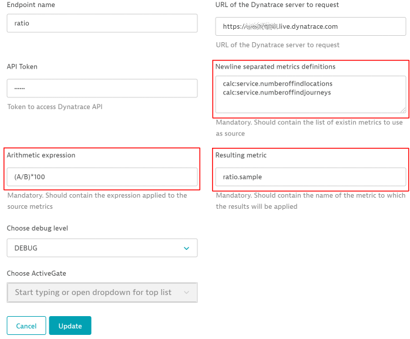
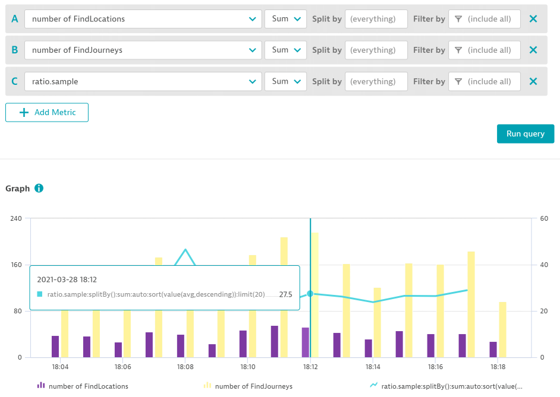

# custom.remote.python.calculated_metrics

## Disclaimer
THIS IS NOT PART OF THE DYNATRACE PRODUCT. This was meant to be a demonstration app, but proved to have some actual utility. It is, however, provided without any representations, warranties, or formal support whatsoever.

Dynatrace ActiveGate extension generating values for a custom metric from a set of existing metrics and a formula (math expression).

Prerequisites: deployed ActiveGate that can reach out to Server's API endpoints.

- This extension does not work yet with dimensions. It was tested on simple, one dimension, metrics...
- The ultimate goal was to be able to alert on the result of a ratio (or other expression) taken from existing metrics; thus requiring to produce a new metrics upon which custom alerting could be configured...
- This implementation should hopefully be a temporary solution, until the new metrics explorer provides this capability...

The purpose of this plugin is to gather 1 to 10 metrics from Dynatrace, apply an arithmetic expression on the retrieved values and push back the result as a new ingest.
Being an ActiveGate plugin, it triggers every minute.

Note: It uses API v2 only. It does not create any device nor device related data.

Inputs will be : 
- ordered list of 1 to 10 existing metric selectors 
  *  Each selector will be assigned to a letter from A to J (first selector will be A, second will be B, ...)
- formula (mathematical expression) to compute on the values retrieved for each provided selector, using placeholders in the form of letters from A to J.
    Example : "(A/B)*100"   
  *  Before evaluating the expression, A will be replace by the value found for the first provided selector, B for the second, ...
- name of the metrics to populate with the evaluation result.

## Inputs

## Outputs

